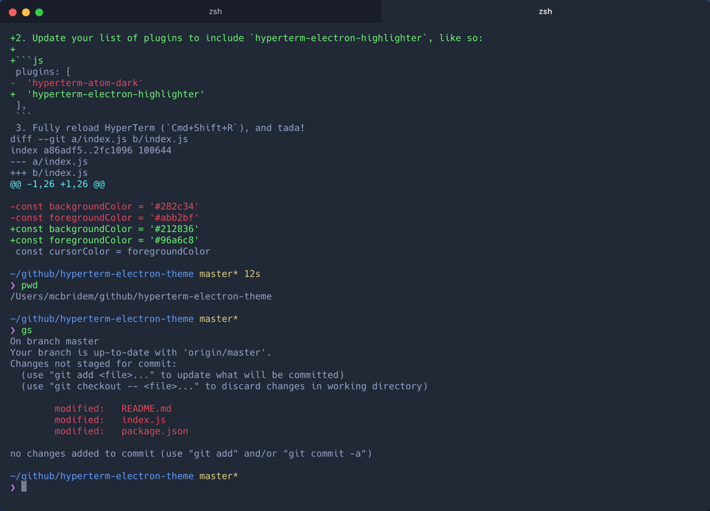

# Atom Electron Highlighter for HyperTerm

[HyperTerm](https://hyperterm.org) theme based on [the Atom Electron Highlighter Syntax](https://github.com/mmcbride1007/electron-highlighter-syntax). Forked from @mdo's [HyperTerm Atom Dark](https://github.com/mdo/hyperterm-atom-dark) and modified by @mmcbride1007.



### Install

1. Open HyperTerm's preferences with `Cmd + ,` (or manually at `~/.hyperterm.js`) with your editor.
2. Update your list of plugins to include `hyperterm-electron-highlighter`, like so:

  ```js
plugins: [
  'hyperterm-electron-highlighter'
],
```
3. Fully reload HyperTerm (`Cmd+Shift+R`), and tada!

### License

MIT
